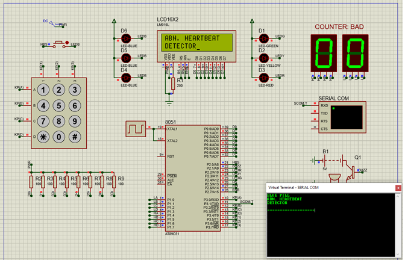

# Abnormal Heartbeat Detector

# Simulation
- Proteus 8 Professional
## 

# Specifications
- XTAL Freq = 12 MHz
- MP Freq = 12 MHz
- MP Used = AT89C51 (8051)
- Baud Rate = 31.250 bps

# Credits
- https://www.medicalnewstoday.com/articles/235710#normal-resting-heart-rate
- https://www.freeprintablemedicalforms.com/preview/Resting_Heart_Rate_Chart 
- https://www.electronicsforu.com/resources/learn-electronics/16x2-lcd-pinout-diagram 

## Developer
### Bryan Oliver
- NPM : 1806200305
- Almamater : Universitas Indonesia
### Muhammad Farid Rahman
- NPM : 1806148662
- Almamater : Universitas Indonesia
### Ramadhan Kalih Sewu
- NPM : 1806148826
- Almamater : Universitas Indonesia
### Qisas Tazkia Hasanuddin
- NPM : 1806200210
- Almamater : Universitas Indonesia
